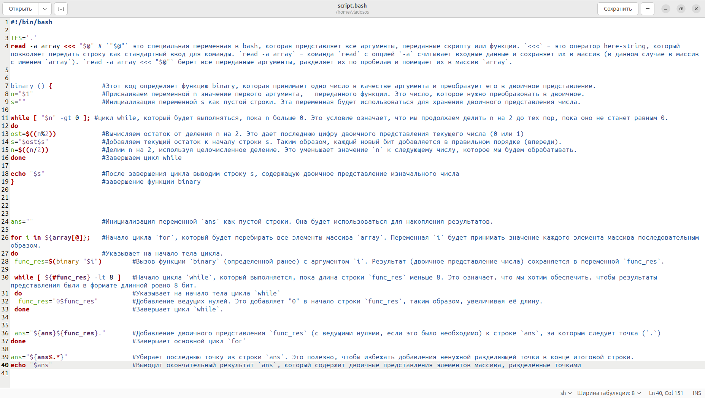

# Лабораторная работа №1 (Зюзин Владислав К3220)

***Задание лабораторной работы***

В ходе работы был создан файл script.bash, в который был занесён скрипт, описанный на картинке. 

На ней я в комментариях указал, что было проделано для работоспособности программы 

