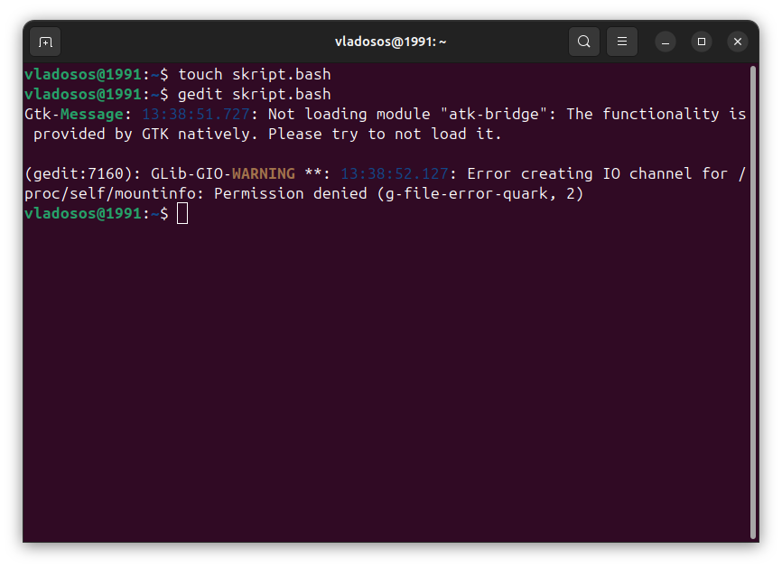
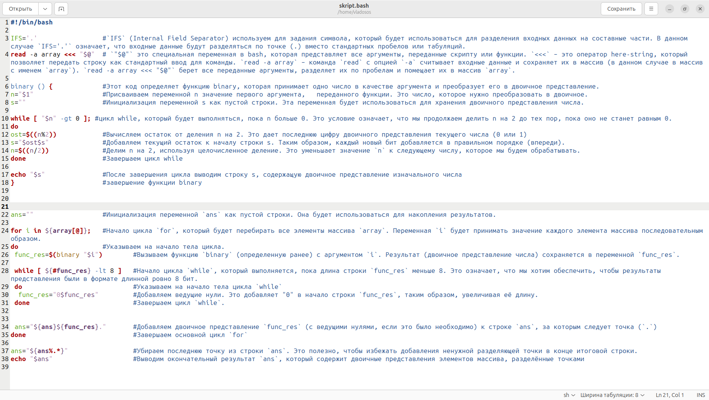
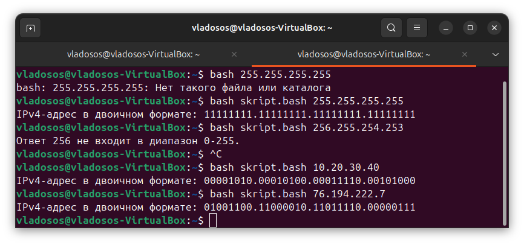

# Лабораторная работа №1 (Зюзин Владислав К3220)

***Задание лабораторной работы***

В ходе работы был создан файл **script.bash** с помощью команды:
```
touch skript.bash
```
Далее был открыт текстовый редактор **gedit**
```
gedit skript.bash
```


В **gedit** был занесён скрипт, на нём (в комментариях) я указал, что было проделано для работоспособности программы : 




Как мы видим, программа функционирует и при вводе любых переменных в десятичном коде мы получаем нужную переменную в двоичном



## Заключение

В данной лабораторной работе были расширены познания в командном интерпретаторе bash, который является языĸом программирования.

