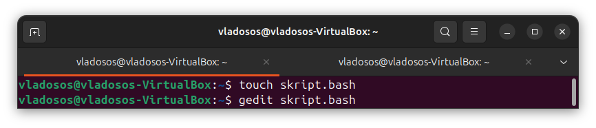

# Лабораторная работа №1 (Зюзин Владислав К3220)

***Задание лабораторной работы***

В ходе работы был создан файл `script.bash`, в который был занесён скрипт, на нём я в комментариях указал, что было проделано для работоспособности программы : 
#!/bin/bash

IFS='.'     #`IFS` (Internal Field Separator) используем для задания символа, который будет использоваться для разделения входных данных на составные части. В данном случае IFS='.' означает, что входные данные будут разделяться по точке (.) вместо стандартных пробелов или табуляций.
read -a array <<< "$@"   # "$@" это специальная переменная в bash, которая представляет все аргументы, переданные скрипту или функции. <<< – это оператор here-string, который позволяет передать строку как стандартный ввод для команды. read -a array – команда read с опцией -a считывает входные данные и сохраняет их в массив (в данном случае в массив с именем array). read -a array <<< "$@" берет все переданные аргументы, разделяет их по пробелам и помещает их в массив array. 

binary () {    #Этот код определяет функцию binary, которая принимает одно число в качестве аргумента и преобразует его в двоичное представление.
n="$1"      #Присваиваем переменной n значение первого аргумента,   переданного функции. Это число, которое нужно преобразовать в двоичное.
s=""      #Инициализация переменной s как пустой строки. Эта переменная будет использоваться для хранения двоичного представления числа.

while [ "$n" -gt 0 ]; #цикл while, который будет выполняться, пока n больше 0. Это условие означает, что мы продолжаем делить n на 2 до тех пор, пока оно не станет равным 0.
do       
ost=$((n%2))    #Вычисляем остаток от деления n на 2. Это дает последнюю цифру двоичного представления текущего числа (0 или 1)
s="$ost$s"    #Добавляем текущий остаток к началу строки s. Таким образом, каждый новый бит добавляется в правильном порядке (впереди).
n=$((n/2))    #Делим n на 2, используя целочисленное деление. Это уменьшает значение n к следующему числу, которое мы будем обрабатывать.
done      #Завершаем цикл while

echo "$s"    #После завершения цикла выводим строку s, содержащую двоичное представление изначального числа
}      #завершение функции binary

ans=""      #Инициализация переменной ans как пустой строки. Она будет использоваться для накопления результатов.
      
for i in ${array[@]};  (Начало цикла for, который будет перебирать все элементы массива array. Переменная i будет принимать значение каждого элемента массива последовательным образом.
do      #Указываем на начало тела цикла).
 func_res=$(binary "$i")  #Вызываем функцию binary (определенную ранее) с аргументом i. Результат (двоичное представление числа) сохраняется в переменной func_res.
  
 while [ ${#func_res} -lt 8 ]  #Начало цикла while, который выполняется, пока длина строки func_res меньше 8. Это означает, что мы хотим обеспечить, чтобы результаты представления были в формате длинной ровно 8 бит.
 do        #Указываем на начало тела цикла while
  func_res="0$func_res"    #Добавляем ведущие нули. Это добавляет "0" в начало строки func_res, таким образом, увеличивая её длину.
 done        #Завершаем цикл while.

 ans="${ans}${func_res}."  #Добавляем двоичное представление func_res (с ведущими нулями, если это было необходимо) к строке ans, за которым следует точка (.)
done        #Завершаем основной цикл for

ans="${ans%.*}"      #Убираем последнюю точку из строки ans. Это полезно, чтобы избежать добавления ненужной разделяющей точки в конце итоговой строки.    
echo "$ans"      #Выводим окончательный результат ans, который содержит двоичные представления элементов массива, разделённые точками

Как мы видим, программа функционирует и при вводе любых переменных в десятичном коде мы получаем нужную переменную в двоичном

## Заключение

В данной лабораторной работе были расширены познания в командном интерпретаторе bash, который является языĸом программирования.

