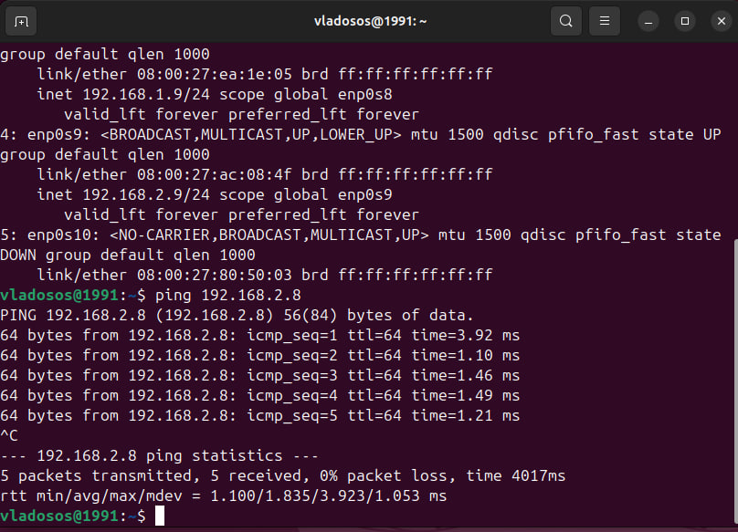
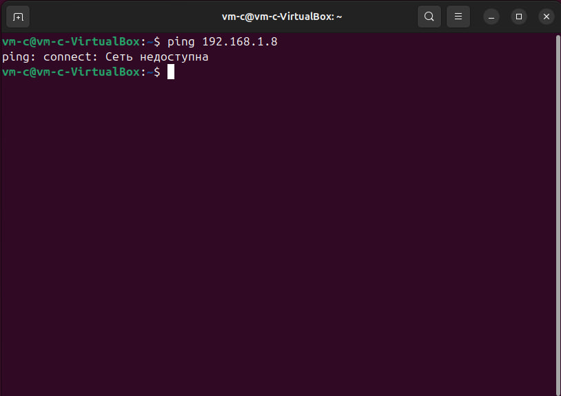

# Лабораторная работа №3 (Зюзин Владислав К3220)
Сначала мною был установлен Virtual Box. После я создал виртуальную машину **VM_A (main machine)**, с которой взаимодействовали 2 другие виртуальные машины, о которых будет написано дальше, создание ВМ было осуществимо благодаря дистрибутиву **Ubuntu 24.04.01**.
## Начало - настройка машины А 
Заходим в настройки машины А, переходим во вкладку сеть. Необходимо предоставить доступ в интернет. Выбираем 1 адаптер, подключаем NAT. Такой тип подключения даёт доступ к сети Интернет. NAT обеспечивает изоляцию ВМ от мнешних соединений. Запросы проходят через хост-систему, таким образом получаем доступ в Интернет.


Теперь проверим доступ в сеть. Для этого воспользуемся последовательно командой:
```
bash
ping -c 4 google. com
```
Команда `ping`  позволяет отправлять запросы по ip-адресу.
С помощью вышеописанной команды попытаемся подключиться к гуглу:


Подключение работает, пакеты дошли

## Настроим машину B

Создаём машину В. Заходим в настройки - сеть. В 1 адаптере ставим тип подключения - Внутренняя сеть и выбираем имя, я использовал LAN1. 


В машину А заносим тот же тип подулючения и имя, но на втором адаптере.


## Проверяем подключение машин А и В

Заносим в терминал команду:
```
ip a
```
После её введения экране видно несколько сетей. Первый интерфейс это loopback. Он есть на каждом устройстве, у него ip **127.0.0.1**. Так хост может обратиться к себе же самому. 
**enp0s3** - это сеть для выхода в интернет, **enp0s8** - локальная сеть между ВМ А и В. С помощью команды:
```
sudo ip addr add 192.168.1.9/255.255.255.0 dev enp0s8
```
мы сможем добавить ip-адрес для подключения

Введём ещё раз команду
```
ip a
```
Чтобы убедиться в отсутсвии ошибок в добавлении ip-адреса


Выделенная строка - добваленный ip-адрес для подключения

Теперь делаем те же действия для ВМ В, но меняем номер мвшины на **192.168.1.8**, а **enp0s8** на **enp0s3**.


## Проверим работу машин А и В

Используем следующую команду для машины А:
```
ping 192.168.1.8
```


На машине В:
```
ping 192.168.1.9
```


Как можно заметить, всё работает в обе стороны.

## Реализуем подключение ВМ А и С

Создаём ВМ С. Ткнём на ВМ А в стевых настройках в 3 адаптере включим тип подключения - Внутренняя сеть, обзавём её - LAN2.


У машины С те же настройки, только в 1 адаптере.


Теперь проделываем идентичные действия, что и для подключения ВМ А и В. Меняем ip ВМ А на **192.168.2.9**, т.к. мы используем другую подсеть и добавим порт с нужным ip в машине А для **enp0s9**:
```
sudo ip addr add 192.168.2.9/255.255.255.0 dev enp0s9
```
В терминале получим:


Для машины С ip - **192.168.2.8**, введём команду:
```
sudo ip addr add 192.168.2.8/255.255.255.0 dev enp0s3
```


## Проверим работу машин А и С

ВМ А:



ВМ С:


## Проверим, отсутствует ли соединение между машинами В и С

В этом нам поможет команда `ping`.

От В к С:
```
ping 192.168.2.8
```


От С к В:
```
ping 192.168.1.8
```


**На скриншотах видно, что подключение отсутсвует.**

## Все три терминала вместе


# Заключение 
В ходе работы были изучены методы добавления ip-адресов, настройки каналов связи и подключения ВМ друг с другом.
