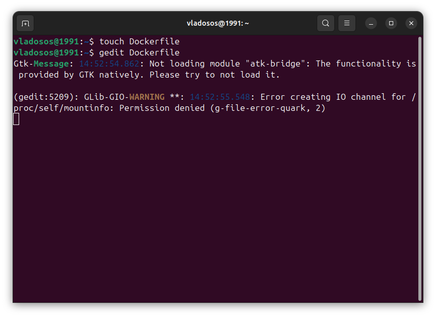

# Лабораторная работа №4 (Зюзин К3220)
## Начнём с создания docker image (образа)
Для этого напишем Dockerfile. Создаём пустой текстовый документ с помощью:
```
touch Dockerfile

```
и

```
gedit Dockerfile

```



В нём прежде всего указываем, на основе какого образа будет работать наш.
```
FROM ubuntu:latest
```
Далее указываем, что мы хотим запустить. В нашем случае мы обновляем пакетный менеджер и устанавливаем необходимое нам ПО.
```
RUN apt-get update && apt-get install -y libaa-bin iputils-ping
```


На этом Dockerfile готов, закрываем и сохраняем его под этим названием. В терминале в папке с этим файлом запускаем команду сборки образа с тегом “aafire”.
```
sudo docker build -t aafire .
```
Далее можем запустить контейнер и  подключиться к нему напрямую командой
```
sudo docker run -it aafire
```


И уже напрямую в терминале контейнера запустить команду 
```
aafire
```


Видно, что контейнер запущен и все работает.

Теперь запустим 2 контейнера из нашего образа и настроим связь между ними.


Откроем ещё одно окно терминала и создадим сеть при помощи команды:
```
docker network create mynetwork
```
После этого нужно подключим контейнеры к нашей сети. Названия контейнеров можно увидеть при выводе списка действующих контейнеров.


Теперь при помощи следующей команды посмотрим настройки нашей сети.
```
docker network inspect mynetwork
```


Контейнеры соединены. Теперь проверим соединение при помощи команды ping. Ip-адреса мы узнали из предыдущей команды.


Все отлично работает!
