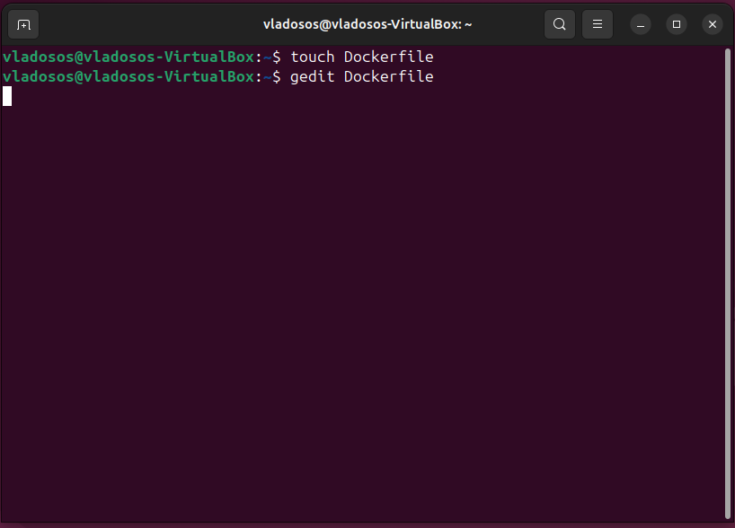
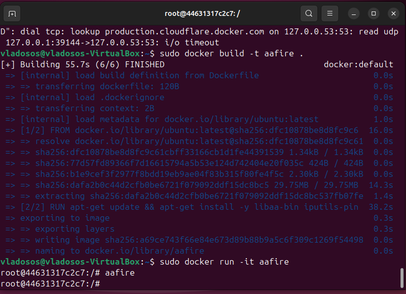
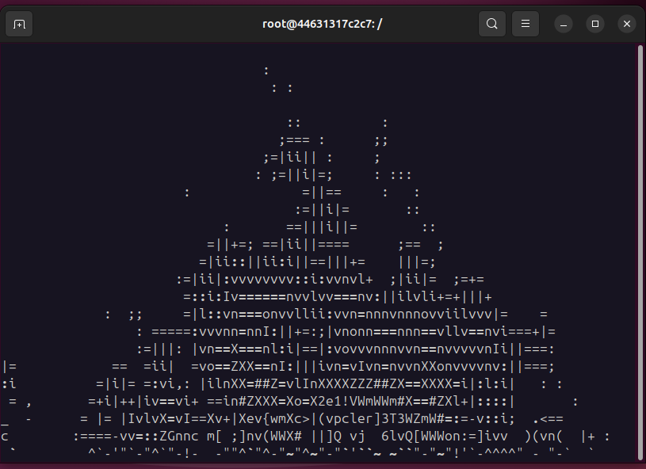
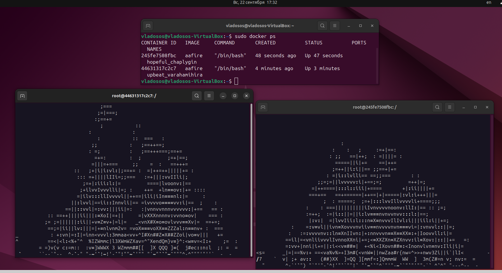
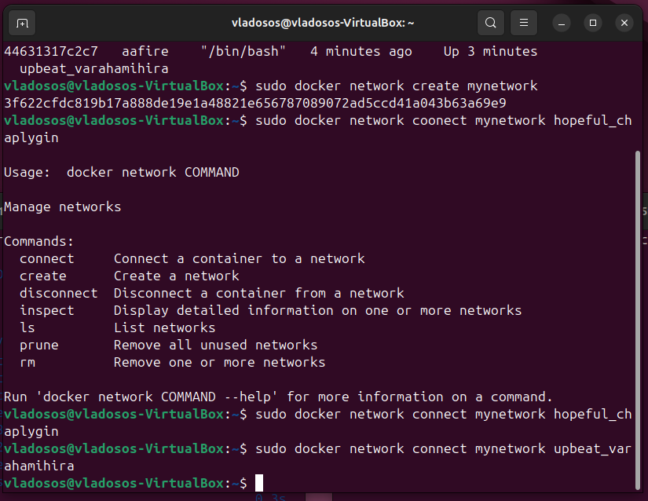
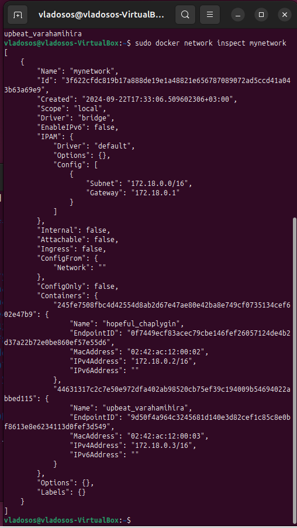

# Лабораторная работа №4 (Зюзин К3220)
## Начнём с создания docker image (образа)
Для этого напишем Dockerfile. Создаём пустой текстовый документ с помощью:
```
touch Dockerfile

```
и

```
gedit Dockerfile

```



В нём прежде всего указываем, на основе какого образа будет работать наш.
```
FROM ubuntu:latest
```
Далее указываем, что мы хотим запустить. В нашем случае мы обновляем пакетный менеджер и устанавливаем необходимое нам ПО.
```
RUN apt-get update && apt-get install -y libaa-bin iputils-ping
```


На этом Dockerfile готов, закрываем и сохраняем его под этим названием. В терминале в папке с этим файлом запускаем команду сборки образа с тегом “aafire”.
```
sudo docker build -t aafire .
```
Далее можем запустить контейнер и  подключиться к нему напрямую командой
```
sudo docker run -it aafire
```


И уже напрямую в терминале контейнера запустить команду 
```
aafire
```


Контейнер работает, картинка видна.

P.S. Лучше сразу после запуска картинки нажать на `enter`, чтобы контейнер не занял много памяти.

## Теперь запустим 2 контейнера из нашего образа и настроим связь между ними.

Для этого вызываем новую командную строку, вводим команду:
```
sudo docker run -it aafire
```
и выполняем те же действия, что и для первого контейнера.

После, с помощью команды:
```
sudo docker ps
```
мы можем увидеть идентификатор контейнера, имя, образ, время создания и использование ресурсов.



Откроем ещё одно окно терминала и создадим сеть при помощи команды:
```
sudo docker network create mynetwork
```
После этого нужно подключить контейнеры к нашей сети. Для этого нужно внести имена контейнеров в команду:
```
sudo docker network connect mynetwork <container's name>
```



Теперь при помощи следующей команды посмотрим настройки нашей сети.
```
sudo docker network inspect mynetwork
```


Контейнеры соединены. Теперь проверим соединение при помощи команды ping. Ip-адреса мы узнали в строке `IPv4Address`.


Команда принята, контейнеры обменялись пакетами.

## Заключение.

В ходе работы были получены знания о создании образов и установки связи между контейнерами. 
