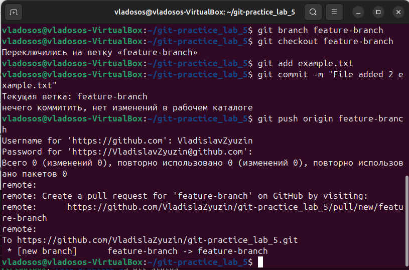
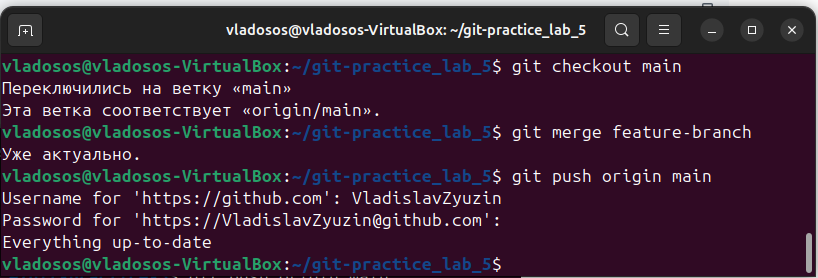

# Лабораторная работа 5
## Введение

На GitHub создал новый репозиторий с именем practice5. В папке на компьютере сохранил его локальную копию:
```
git clone https://github.com/VladislaZyuzin/git-practice-5.git
```
```
bash
```
```
cd giy-practice-5
```


Далее создаю текстовый файл в папке и добавляю в него текст. Завершаю эту часть, внеся изменения в репозиторий с помощью следующих команд:
```
git add example1.txt
```
```
git commit -m "File added example1.txt"
```


```
git push origin main
```


При введении пароля может возникнуть ошибка, указывающая на то, что GitHub перестал поддерживать аутентификацию с использованием паролей для операций, таких как push. Вместо этого следует использовать Personal Access Token (PAT). Для этого на сайте гитхаба создаём токкен с разрешением доступа к репозиторию: repo. После получения ключа, сохраняем его у себя и используем вместо пароля.

Создаём ветку и переключаемся на неё:
```
git branch feature-branch
```
```
git checkout feature-branch
```
В новую созданную ветку feature-branch добавим старый файл, в котором будет добавлен ещё текст:
```
git add example.txt
```
```
git commit -m "File added 2 example.txt"
```
```
git push origin feature-branch
```


В завершение, переключимся на основную ветку и сольём изменения из ветки feature-branch в основную ветку:
```
git checkout main
```
```
git merge feature-branch
```
```
git push origin main
```


Таким образом, изменения были успешно слиты в главную ветку.

## Работа с ветками
Создаём новый текстовый файл с базовой структурой книги:
```
# Название книги

## Глава 1: Введение
Введение в тему книги.

## Глава 2: Основы Git
Основные понятия и команды Git.
```
Создаю новую ветку и переключаюсь на неё:
```
git checkout -b feature-login
```
Вношу изменения в файл:
```
# Название книги
## Глава 1: Введение
Здесь будет введение в тему книги.

## Глава 2: Основы Git
Основные понятия и команды Git.

## Глава 3: Вход в систему
Раздел по новой функциональности входа в систему.
```
В конце завершаю изменения и отправляю их в ветку на GitHub:
```
git add example2.md
git commit -m "Добавлена глава 3: Вход в систему"
git push origin feature-login
```

## Работа с удаленным репозиторием
Переключаемся на ветку main и там вносим изменения:
```
git checkout main
```
Вносим изменения в нашем файле:
```
# Название книги: Приключения в мире Git

## Глава 1: Введение
Здесь будет введение в удивительный мир Git.

## Глава 2: Основы Git
Основные понятия и команды Git.
```
Закоммитим изменения и отправим всё на GitHub:
```
git add example2.md
git commit -m "Изменено название книги и введение"
git push origin main
```
## Моделирование конфликта
Возвращаемся в ветку "feature-login" и вносим изменения в том же участке:
```
git checkout feature-login
```
Меняем главу 2 в файле:
```
# Название книги: Приключения в мире Git

## Глава 1: Введение
Здесь будет введение в удивительный мир Git.

## Глава 2: Основы Git и магия конфликтов
Основные понятия и команды Git, а также волшебство разрешения конфликтов.
```
Делаем коммит изменений и отправляем на GitHub:
```
git add example2.md
git commit -m "Добавлен раздел о магии конфликтов"
git push origin feature-login
```
## Разрешение конфликта
Вернёмся в основную ветку и попробуем слить изменения:
```
git checkout main
git merge feature-login
```
Возникает конфликт, а в самом файле появляется вот такой текст:

```
# Название книги: Приключения в мире Git

## Глава 1: Введение
Здесь будет введение в удивительный мир Git.

<<<<<<< HEAD
## Глава 2: Основы Git и магия конфликтов
Основные понятия и команды Git, а также волшебство разрешения конфликтов.
======= 
## Глава 2: Основы Git
Основные понятия и команды Git. 
>>>>>>> feature-login
```
В консоли появятся такие сообщения:


Разрешаем конфликт, удалив метки и оставив нужные изменения:
```
# Название книги: Приключения в мире Git

## Глава 1: Введение
Здесь будет введение в удивительный мир Git.

## Глава 2: Основы Git и магия конфликтов
Основные понятия и команды Git, а также волшебство разрешения конфликтов.
```
Закоммитим разрешение конфликта и отправляем изменения на GitHub:
```
git add example2.md
git commit -m "Resolved conflict in chapter 2"
git push origin main
```
## Автоматизация проверки файлов при коммите
Поставлена задача: перед каждым коммитом необходимо автоматически проверять, 
чтобы все .txt файлы в репозитории соответствовали определенному формату.

В таком случае пускай сами проверяемые файлы будут книгами в формате .txt, 
а соответствие наших файлов искомым будем проверять поиском подстроки "Введение", так как в каждой книге оно есть.
Поместим скрипт в папку .git/hooks в файл pre-commit. 
```
#!/bin/bash
if grep -q "Введение" ex.txt
 then echo "Этот файл - книга"
else
 echo "Этот файл не может быть книгой"
fi
```
Вот скрин, подтверждающий работу скрипта:


Таким образом, при каждом коммите файла происходит его проверка и высвечивается сообщение, 
говорящее о том, является ли наш файл книгой или нет.
## Использование Git Flow в проекте
Выполняем инициализацию Git Flow в корне репозитория:
```
git flow init
```
Создадим ветку для новой функциональности "task-management":
```
git flow feature start task-management
```
Внесу изменения в код файла task_manager.py, чтобы добавить функционал управления задачами:
```
def create_task(title):
    # Логика создания задачи
    print(f"Создана новая задача: {title}")
```
Сделаю коммит для изменения по мере разработки:
```
git add task_manager.py
git commit -m "Добавлен функционал управления задачами"
```
Завершим фичу и объединим ее с основной веткой когда завершим разработку функции:
```
git flow feature finish task-management
```
Git Flow автоматически переключится на ветку develop и выполнит слияние.

Переключимся на ветку "develop" и начнём создание релиза:
```
git checkout develop
git flow release start v1.0.0
```
Обновим версию в файле version.txt:
```
echo "v1.0.0" > version.txt
git add version.txt
git commit -m "Обновлена версия для релиза v1.0.0"
```
В конце, завершаем релиз и объединяем его с двумя ветками "develop" и "main":
```
git flow release finish v1.0.0
```
Создаём файл hotfix для случаев возникновения ошибок, который будет их исправлять:
```
git flow hotfix start hotfix-1.0.1
```
Вносим изменения для исправления ошибки и коммитим эти самые изменения:
```
# Исправление ошибки
git add file_with_error.py
git commit -m "Исправлена критическая ошибка"
```
Завершаем файл hotfix и объединяем его с ветками "develop" и "main":
```
git flow hotfix finish hotfix-1.0.1
```
В конце, завершаем работу и отправляем все изменения на удаленный репозиторий:
```
git push origin develop
git push origin main
```


