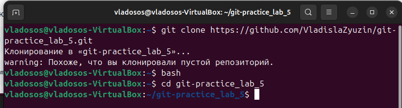
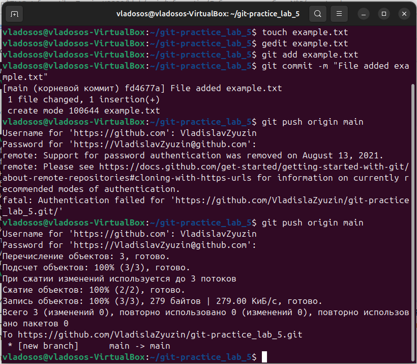

# Лабораторная работа 5
## Введение

На GitHub создал новый репозиторий с именем practice5. В папке на компьютере сохранил его локальную копию:
```
git clone https://github.com/VladislaZyuzin/git-practice-5.git
```
```
bash
```
```
cd giy-practice-5
```



Далее создаю текстовый файл в папке и добавляю в него текст. Завершаю эту часть, внеся изменения в репозиторий с помощью следующих команд:
```
git add example1.txt
```
```
git commit -m "File added example1.txt"
```


```
git push origin main
```


При введении пароля может возникнуть ошибка, указывающая на то, что GitHub перестал поддерживать аутентификацию с использованием паролей для операций, таких как push. Вместо этого следует использовать Personal Access Token (PAT). Для этого на сайте гитхаба создаём токкен с разрешением доступа к репозиторию: repo. После получения ключа, сохраняем его у себя и используем вместо пароля.

Создаём ветку и переключаемся на неё:
```
git branch feature-branch
```
```
git checkout feature-branch
```
В новую созданную ветку feature-branch добавим старый файл, в котором будет добавлен ещё текст:
```
git add example.txt
```
```
git commit -m "File added 2 example.txt"
```
```
git push origin feature-branch
```


В завершение, переключимся на основную ветку и сольём изменения из ветки feature-branch в основную ветку:
```
git checkout main
```
```
git merge feature-branch
```
```
git push origin main
```


Таким образом, изменения были успешно слиты в главную ветку.

## Работа с ветками
Создаём новый текстовый файл с базовой структурой книги:
```
# Название книги

## Глава 1: Введение
Введение в тему книги.

## Глава 2: Основы Git
Основные понятия и команды Git.
```
Создаю новую ветку и переключаюсь на неё:
```
git checkout -b feature-login
```
Вношу изменения в файл:
```
# Название книги
