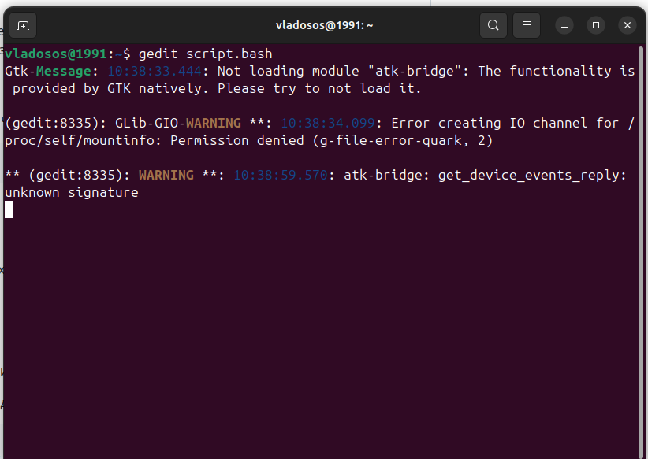
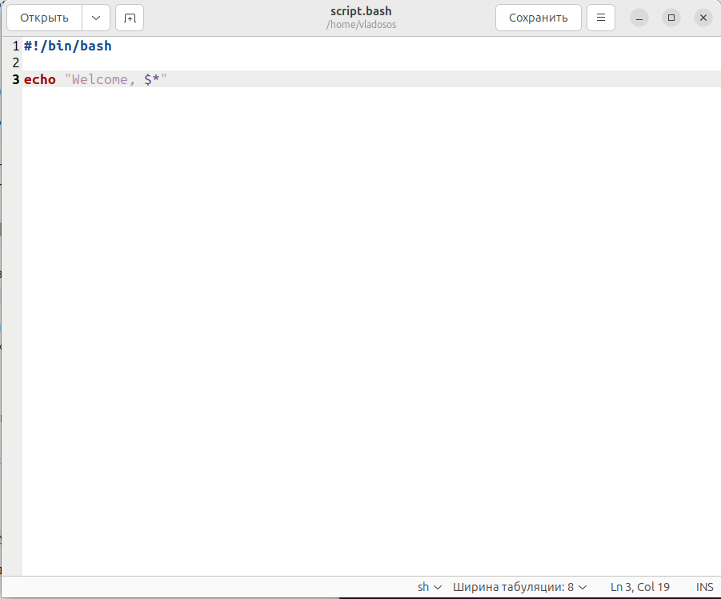

# Лабораторная работа №1 (Зюзин Владислав К3220)

***Вводное задание***

В начале был создан файл с именем `script.bash` в командной строке с помощью команды `touch`: 
```
touch script.bash
```
Затем я открыл его с помощью оператора `gedit` введя команду: 
```
gedit script.bash
```


В gedit я внёс скрипт #!/bin/bash и приветсвие, #!/bin/bash используется для позволяет понять ОС какой командный интерпретатор использовать, в нашем случае это bash. 
Теперь этот скрипт можно запускать, вставлять в другие скрипты и т. д. Перед приветсвием я внёс скрипт echo, который будет вызывать наше приветсвие, занесённое в кавычки


Как мы видим, при запуске bash скрипта:
```
bash script.bash
```
у нас срабатывает команда echo и выводит на командную строку: `Welcome to ITMO University`.


***Основоное задание***

Я открыл вышеописанный файл командой:
```
gedit script.bash
```


Далеее в gedit я изменил приветсвие таким образом, чтобы когда пользователь вызывал с помощью bash файл, а после через пробел ввписав своё имя, 
то он смог получить в командной строке приветсвие и введённый им текст. Для я ввёл команду: `echo "Welcome, $*"`



Сохранив и закрыв текстовый редактор введём команды:
```
bash script.bash Vasya Pupkin
```
и для достоверности:
```
bash script.bash Benedict Timothy Carlton Cumberbatch
```

Как мы видим, мой скрипт сработал, при введении, описанном в методичке ни Вася Пупкин, ни Benedict Timothy Carlton Cumberbatch, сыгравший Шерлока в одноимённом сериале, не останутся обиженными)))


***Заключение***

В ходе работы была освоена в рамках задания работа в терминале Линукс
